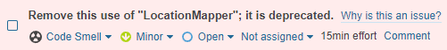

# Manuális kód átvizsgálás
A kód manuális áttekintése folyamán a következő problémák merültek fel:
- nem használt privát mezők
- felesleges importok
- kikommentezett kódsorok
- üres metódus
- túl komplex metódusok
- string konkatenáció összeadás operátorral
- factory osztályok privát konstruktor nélkül
## Eredmények és tanulságok
A felesleges sorok, mezők, importok törlésre kerültek. Üres metódus belsejébe exception dobás került. A túl komplex metódusokat lerövidítettem, kiszerveztem kisebb metódusokba, amelyek meghívásra kerülnek. A factory osztályokhoz privát konstruktort adtam, hogy ne lehessen belőlük példányt létrehozni.

Mindenképp fontos manuálisan átnézni a kódot, hiszen így lehet jobban megérteni a program működését, a kód első megírását követően az újraolvasás akár lényeges rövidítésekhez, refaktoráláshoz is vezethet.
# Statikus analízis eszköz futtatása
A SonarCloud beüzemelése után az elemzés megtalált 19 bugot és 93 code smellt, amely az alábbi ábrán látszik is:

## Bugok
A 19 bug mind ugyanazt a hibát jelezte:

Itt az a probléma, hogy az `if` feltételében ugyan ellenőrizve van, hogy a visszaadott objektum érvényes-e, de később újra a függvényhívás segítségével van lekérve az objektum, ami időközben más objektummal is visszatérhet. Megoldásképpen egy változóban tároltam el a lekért objektumot, és utána ugyanazt a változót használva megoldódik a probléma.

## Code smellek
A manuális átvizsgálás folyamán a code smellek száma is lecsökkent, azonban még maradt pár eset, amelyet lehetett javítani. Például maradt olyan függvény, ami még mindig túl komplexnek ítéltetett, vagy felesleges import maradt a kódban.

Továbbá arra is volt példa, amit nem lehetett kijavítani. Az alábbi képen látszik az a code smell, amelyet jelenleg nem lehet eltüntetni, hiszen az alkalmazás olyan libraryt használ, amibe szintén az elavult osztály van importálva.

## Eredmények és tanulságok
Sok problémára felhívják a figyelmet a különféle statikus analízis eszközök, és nagy mértékben javítható a kód minősége. Ilyen eszközök használata során is fontos a következetesség, érdemes egységesen javítani, hogy azonos problémák hasonlóan és midenhol ki legyenek javítva. Vannak problémák, amelyek nem csak a saját kódbázistól függnek, ilyen esetben nem mindig eliminálható a probléma. 