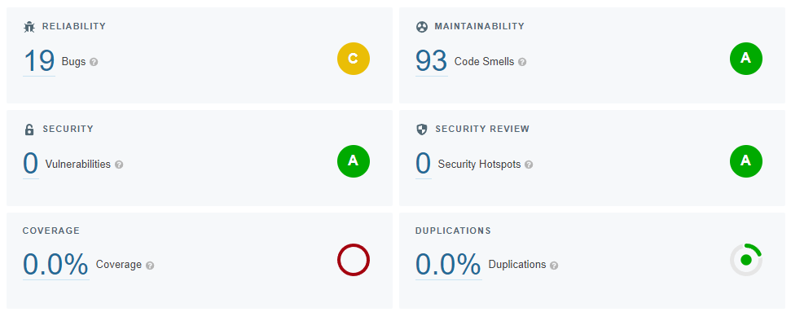

# Manuális kód átvizsgálás

## Eredmények és tanulságok

# Statikus analízis eszköz futtatása
A SonarCloud beüzemelése után az elemzés megtalált 19 bugot és 93 code smellt, amely az alábbi ábrán látszik is:

## Bugok
A 19 bug mind ugyanazt a hibát jelezte:

Itt az a probléma, hogy az `if` feltételében ugyan ellenőrizve van, hogy a visszaadott objektum érvényes-e, de később újra a függvényhívás segítségével van lekérve az objektum, ami időközben más objektummal is visszatérhet. Megoldásképpen egy változóban tároltam el a lekért objektumot, és utána ugyanazt a változót használva megoldódik a probléma.

## Eredmények és tanulságok
