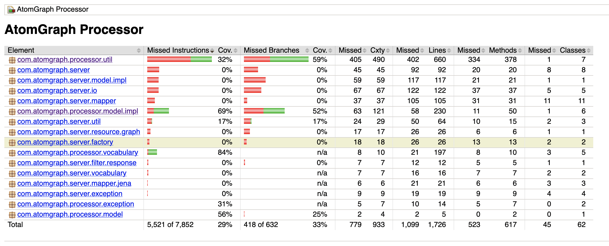
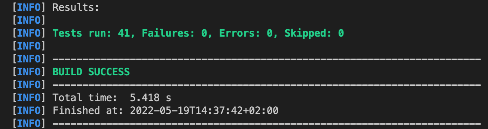

### Unit testing

Ennek a projektnek a felépítését, osztályait és tényleges célját csak limitáltan sikerült megérteni, így a tesztek hasznossága is korlátozott. A fő cél az volt, hogy JUnit 5-öt használjunk és hogy JaCoCo-val mérjük a teszteknek a kód lefedettségét.

JaCoCo használata:

A következő parancs futtatásával a target/site/jacoco/index.html fájlban található a tesztek kódlefedettségének egy grafikus megjelenítése:

`mvn jacoco:prepare-agent test install jacoco:report`

Az eredmény a következőképpen néz ki:

Minden test futtatására a következö parancs használható:

`mvn test`

Ha minden teszt hiba nélkül lefut, akkor az eredmény utolsó pár sora a következőképpen néz ki:

