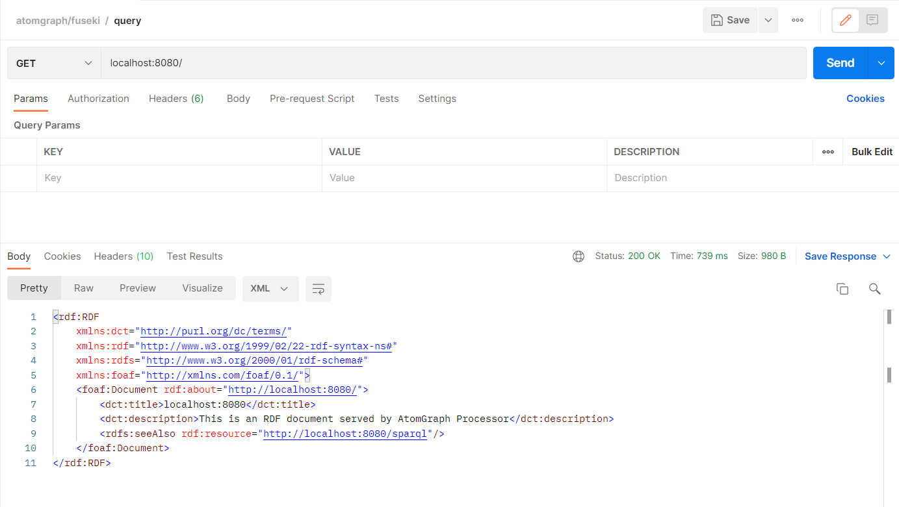
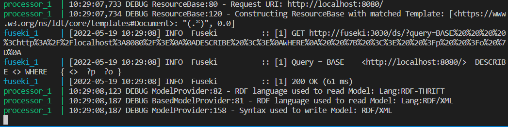
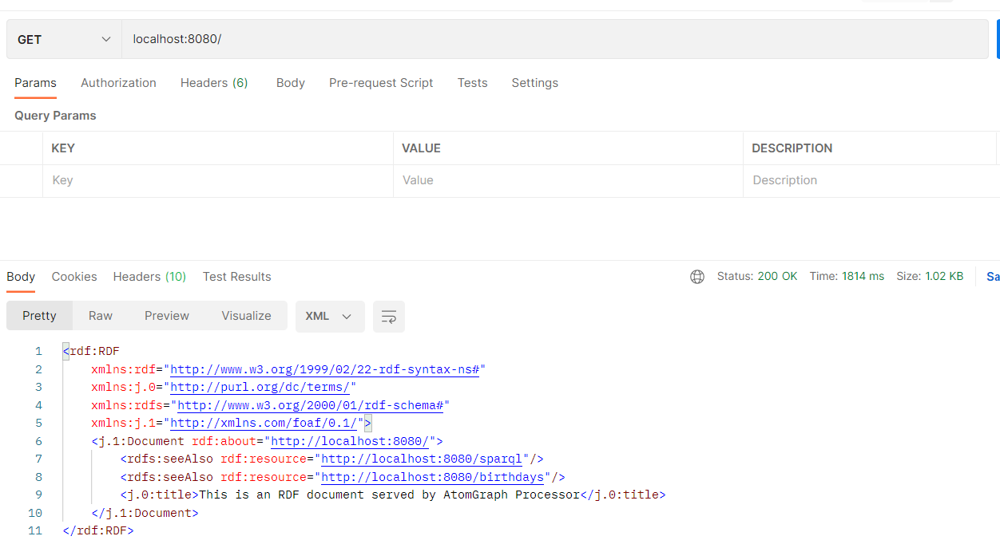
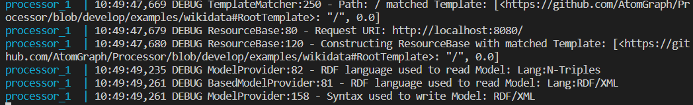
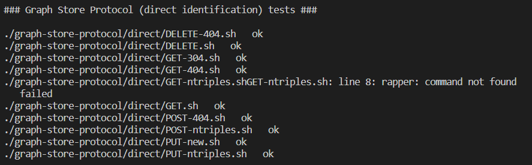

# Manuális tesztelés

A program önmagában nem használható így a példa lehetőségeket (examples mappa) illetve az előre megírt http-tests-et vettem alapul. 

Mivel a http-tests tartalmaz egy futtatható autómatizált előre megírt teszt csomagot ezért külön nem írtam újakat hanem ezek beüzemelésével és a példák vizsgálatával foglalkoztam.

## Docker

Ahhoz hogy a pédákat és a tesztet futtathassuk dockert használhatunk. Ehhez szükséges, hogy legyen a eszközön docker én ehhez windows-on a Docker Desktopot használtam. 

Ha fut a program akkro a megfeleló könyvtárakban (pl.: examples/fuseki) kiadott docker-compose up pranacsal a elíndíthatjuk az image-eket az adott mappában található docker-compose.yml beállításai alapján. 

## Példák

### fuseki

Ebben a példában egy lokális SPARQL szolgálatót a Fusekit futatjuk együtt a Processzorral. A docker parancs elindítása után ki is próbálhatjuk: én Postmant használtam, a yml a 8080 portra állítja ba a processort és 3030-ra fusekit:

### wikidata

Ebben a példában egy lokális SPARQL szolgálatót a Wikidatát használjuk együtt a Processzorral. Itt egy egyedi előre definiált LTD ontológiát használunk ami a wikidat.ttl fájlban van leírva. 
Itt is a 8080-as porton érjük el a processort:

## Teszt

Az előre megírt tesztek a http-teszt mappában találhatóak.
Itt is a fusekit haszáljuk szolgálatatónak, csak itt több image-et is létrehozunk a különböző tesztek csoportosításához különböző portszamokkal.
Ha futtatjuk a run.sh az minden tesztesethez feltölti a hármasokat, majd lefuttatja a további shell scripteket amelyek http-kérsekkel furdulnak a processorhoz.
Itt is a docker-compose up parancsával indíthatóak el az image-ek a teszteket pedig a run.sh futtatásával (git bash-ben pl.: sh run.sh) indíthatjuk el.

Csak az egyik részletet fotóztam be ami a graph-store-protocol-hoz tartozik:

(A hiba a rapper parancs hiánya miatt van amit "Raptor 2 RDF parser and serializer utilities"-al lehetne telepíteni.)